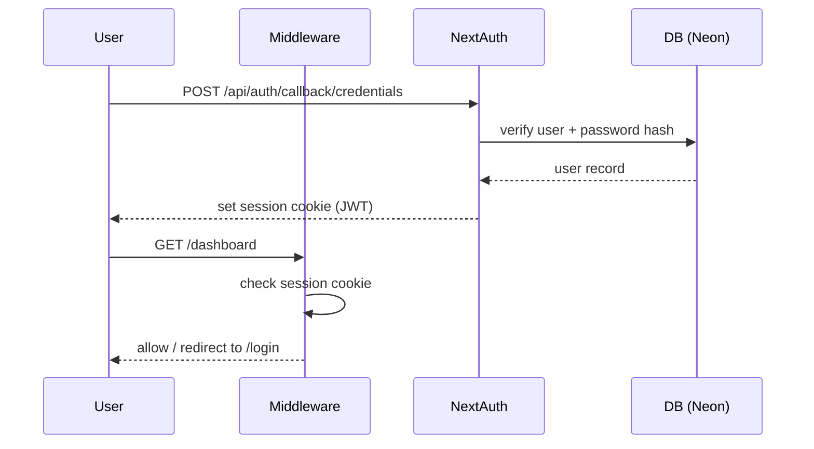
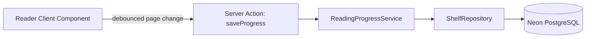

# ARCHITECTURE.md

## 1. Overview

Bookshelf is a Next.js (App Router) PWA. Server Components render structural/data-bound
UI; Client Components ("islands") own interactivity — GSAP timelines, WebGL/GLSL
backgrounds, Framer Motion transitions. Data layer targets Neon PostgreSQL via Prisma.

## 2. Layering

```
app/            route segments (pages, layouts, route handlers) — RSC by default
components/     presentational + interactive UI, grouped by domain
lib/            cross-cutting: auth config, db client, server actions, zod validations
server/         services (business logic) + repositories (Prisma queries)
prisma/         schema + migrations
public/         static assets
types/          shared TS types
docs/           this documentation set
```

Dependency direction: `app` → `components` → `lib`/`server`. `server/services` are the
only layer allowed to call `server/repositories`; components never import Prisma
directly — they call server actions in `lib/actions`, which call `server/services`.

## 3. Rendering Strategy

- **Server Components**: data fetching, SEO-critical content, layout shells.
- **Client Components**: anything using `useState`, GSAP, `@react-three/fiber`,
  Framer Motion, or browser APIs. Marked `"use client"` and kept as leaf nodes to
  minimize hydration cost.
- **Heavy visual components** (WebGL/GLSL backgrounds) are `dynamic(..., { ssr: false })`
  and lazy-loaded below the fold or behind `requestIdleCallback` where possible.
- All motion respects `prefers-reduced-motion`; a static fallback frame exists for
  every animated background.

## 4. Auth Flow

NextAuth.js (Credentials provider for email/password + OAuth providers Google/GitHub).
Session stored as JWT in secure, httpOnly cookies. `proxy.ts` (Next.js 16's renamed
`middleware.ts` entrypoint, same runtime behavior) protects `/dashboard` and `/reader`
route groups and redirects authenticated users away from `/login`/`/signup`. Passwords
will be hashed with bcrypt once a real user store replaces the demo credentials
provider (see ADR-006).



## 5. Data Flow (Reading Progress)



## 6. Current Implementation Status (MVP UI phase)

- ✅ App shell, routing, design system, brutalist dark UI, motion system.
- ✅ Prisma schema modeling PRD §18 (not yet migrated against a live Neon instance).
- ✅ Mock data layer (`lib/mock-data.ts`) powers all pages so UI is fully demonstrable
  without live credentials.
- ⏳ NextAuth wiring present but requires real `DATABASE_URL`, `NEXTAUTH_SECRET`,
  and OAuth client credentials to function end-to-end (see `.env.example`).
- ⏳ Server actions for shelves/progress are stubbed to operate against mock data;
  swapping to Prisma repositories is a drop-in change once a DB is provisioned.
- ⚠️ The mock shelf/reading-progress state in `lib/mock-data.ts` is a single
  module-level singleton, not scoped per authenticated user. Every session that
  signs in resolves to the same demo account, so this is consistent for now, but
  it is not a per-user data store — do not rely on it for isolation once real
  accounts exist (see ADR-006).

See [DECISIONS.md](DECISIONS.md) for the rationale on mock-data-first delivery.