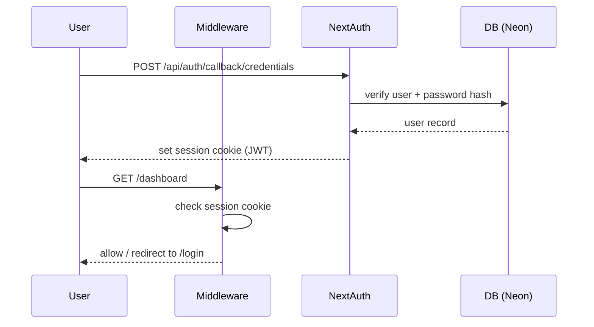
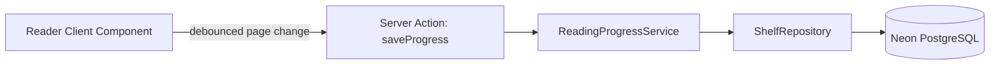

# ARCHITECTURE.md

## 1. Overview

Bookshelf is a Next.js (App Router) PWA. Server Components render structural/data-bound
UI; Client Components ("islands") own interactivity - GSAP timelines, WebGL/GLSL
backgrounds, Framer Motion transitions. Data layer targets Neon PostgreSQL via Prisma.

## 2. Layering

```
app/            route segments (pages, layouts, route handlers) - RSC by default
components/     presentational + interactive UI, grouped by domain
lib/            cross-cutting: auth config, db client, server actions, zod validations
server/         services (business logic) + repositories (Prisma queries)
prisma/         schema + migrations
public/         static assets
types/          shared TS types
docs/           this documentation set
```

Dependency direction: `app` → `components` → `lib`/`server`. `server/services` are the
only layer allowed to call `server/repositories`; components never import Prisma
directly - they call server actions in `lib/actions`, which call `server/services`.

## 3. Rendering Strategy

- **Server Components**: data fetching, SEO-critical content, layout shells.
- **Client Components**: anything using `useState`, GSAP, `@react-three/fiber`,
  Framer Motion, or browser APIs. Marked `"use client"` and kept as leaf nodes to
  minimize hydration cost.
- **Heavy visual components** (WebGL/GLSL backgrounds) are `dynamic(..., { ssr: false })`
  and lazy-loaded below the fold or behind `requestIdleCallback` where possible.
- All motion respects `prefers-reduced-motion`; a static fallback frame exists for
  every animated background.

## 4. Auth Flow

NextAuth.js (Credentials provider for email/password + OAuth providers Google/GitHub).
Session stored as JWT in secure, httpOnly cookies. `proxy.ts` (Next.js 16's renamed
`middleware.ts` entrypoint, same runtime behavior) protects `/dashboard` and `/reader`
route groups and redirects authenticated users away from `/login`/`/signup`. Passwords
are hashed with bcrypt (`server/services/auth-service.ts`, 12 salt rounds) against a
real `User.passwordHash` column - see ADR-007. Both `registerAccount` (signup server
action) and the Credentials `authorize` callback are rate-limited per-IP
(`lib/rate-limit.ts`, in-memory/single-instance) against brute-force and
credential-stuffing attempts.



## 5. Data Flow (Reading Progress)



## 6. Current Implementation Status (MVP UI phase)

- ✅ App shell, routing, design system, brutalist dark UI, motion system.
- ✅ Prisma schema modeling PRD §18, migrated against a live Neon instance (requires
  `DATABASE_URL` + `npx prisma migrate dev` + `npx prisma generate` per environment).
- ✅ Real auth: signup/login are Prisma-backed (`server/services/auth-service.ts`,
  bcrypt) - see ADR-007. `.env.example` documents required secrets.
- ✅ Book/Author/BookPage domain is Prisma-backed (`server/services/book-service.ts`,
  `server/repositories/book-repository.ts`) - see ADR-009. Every book-listing page
  reads live DB content, and the reader serves real imported `BookPage` rows when
  present, falling back to placeholder text only for books with none.
- ✅ Shelf/reading-progress domain is Prisma-backed (`server/services/shelf-service.ts`,
  `server/repositories/shelf-repository.ts`), scoped per authenticated `userId` -
  see ADR-010. `lib/actions/shelf.ts` requires a real session before mutating.
- ⏳ `ReadingHistory` (per-view-event history) has a Prisma model but no write path
  yet; not required by any current feature.

See [DECISIONS.md](DECISIONS.md) for the rationale on mock-data-first delivery and
ADR-009/ADR-010 for the book and shelf domain migrations off it. As of ADR-010,
`lib/mock-data.ts` only backs the User-domain demo-profile display fallback
(`profile.favoriteGenres`) - every book/author/shelf/progress read and write goes
through Prisma.